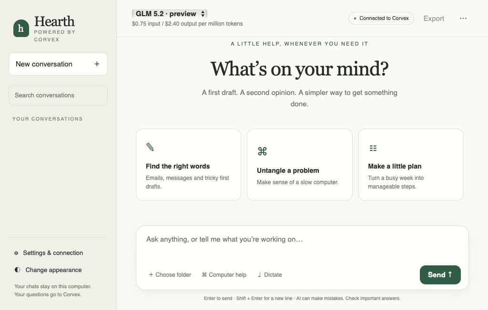

# Hearth for Corvex

A friendly Windows chat app with saved conversations, powered by **your own Corvex Token Factory account**.

**On a Mac?** The [separate Mac preview and instructions](#hearth-for-mac) are below. The Windows download and walkthrough are unchanged.

## [⬇ Download Hearth for Windows](https://github.com/Sophenor/hearth-corvex/releases/latest/download/Hearth-Windows.zip)

**Windows 10/11 · 64-bit Intel/AMD · approximately 50 MB · preview 0.1**

You do **not** need a GitHub account, an OpenAI subscription, or a local AI model to use the app.

### Get started

1. Click **Download Hearth for Windows** above.
2. Right-click the downloaded ZIP and choose **Extract All**.
3. Open **Hearth.exe** in the extracted folder.
4. Follow the app's guide: sign in to Corvex on its website, create an API key, then paste that key into Hearth once.
5. Start chatting. Your conversations are saved automatically on your computer.

Use **your own API key**, not your Corvex password. Never share the key with anyone else. If you have a Corvex invitation, complete that signup first; Hearth does not create accounts or grant free credits.

[Full setup and troubleshooting guide](START%20HERE.txt) · [Release and downloads](https://github.com/Sophenor/hearth-corvex/releases/latest)

### What it can do

- Help draft emails, explain things, plan, and work through everyday questions.
- Keep conversations in a searchable sidebar, with light/dark themes and export.
- Switch between the models available through your Corvex account.
- With your permission, inspect basic computer performance and read small text files in a folder you choose.
- Ask before saving a text draft or requesting that an app close normally.
- Use installed Windows dictation where available, without a large speech-model download.

GLM 5.2 and Kimi K2.7 have been tested through Corvex, including actual file-tool use. New models appear when Corvex lists them; a listing alone does not guarantee tool compatibility.

### Before you use this preview

**This is an unsigned independent app, not an official Corvex product.** Windows may show an unknown-publisher warning. Download only from this repository or someone you trust, and do not disable your antivirus or Windows security protections. Signing and easier installation are future improvements.

The app needs Microsoft Edge WebView2 Runtime, which most recent Windows installations already have. If it is missing, Hearth offers Microsoft's installation page. Windows 11 x64 is the main target. This is not a Mac or native Windows ARM release.

Prompts and permitted tool results go directly to Corvex and use your own account's balance. Credit amounts, pricing and expiry are controlled by Corvex. Your API key is protected using Windows account encryption. Chats are ordinary local files under `%LOCALAPPDATA%\HearthCorvex`; they are not automatically synced to the cloud.

This version does not include live web search, PDF/Word/image attachments, email sending or unrestricted desktop automation. It never force-quits apps or deletes files. Voice availability and accuracy depend on Windows. Check important AI answers.

### Source and development

Hearth uses .NET 10, WinForms/WebView2, and Microsoft's open-source AI function-calling components. The executable bundles .NET, so recipients do not need developer tools.

- [Design, model connection and exact tool limits](docs/DEVELOPMENT.md)
- [Verification summary](docs/VERIFICATION.md)
- [Source licence](LICENSE.txt) and [third-party notices](THIRD-PARTY-NOTICES.txt)

To build from source on Windows, install the .NET 10 SDK and run `./build.ps1` from the repository folder. Source archives are available on the release page; ordinary users should download **Hearth-Windows.zip**, not GitHub's source-code ZIP.

## Hearth for Mac

### [⬇ Download Hearth for Mac](https://github.com/Sophenor/hearth-corvex/releases/download/mac-v0.1.0/Hearth-Mac.zip)

**macOS 13 Ventura or newer · Apple Silicon and Intel · approximately 0.5 MB · preview 0.1.0**

1. Download the Mac ZIP above and double-click it to extract it.
2. Drag **Hearth** into **Applications**, then open it.
3. If macOS cannot verify the developer, go to **System Settings → Privacy & Security → Open Anyway** for Hearth, then confirm. This independent preview is not Apple Developer-ID signed or notarized; do not turn off Mac security. [Apple's guidance](https://support.apple.com/en-gb/102445).
4. Follow the app's setup to create a key in your own Corvex account, then paste that **API key**, not your password, into Hearth once.
5. Start chatting. The included **START HERE - Mac.txt** has the complete family setup guide.

The Mac app has saved chats, model switching, light/dark themes, export, Keychain storage, optional Mac performance checks and optional small-text-file tools. It uses macOS's built-in frameworks; no local AI model, .NET installation, GitHub account or OpenAI subscription is needed. Corvex controls account credits and pricing.

Saving a draft or requesting an app quit needs your approval. There is no file deletion, force quit or arbitrary command tool. macOS Dictation is optional and depends on your Mac/settings. Chats remain on this Mac; they do not automatically sync with the Windows app or Corvex web chat. This preview does not include web search, PDF/Word/image reading or email sending.

[Mac setup and troubleshooting](mac/START%20HERE%20-%20Mac.txt) · [Mac release](https://github.com/Sophenor/hearth-corvex/releases/tag/mac-v0.1.0) · [Mac source/build details](mac/README.md) · [Mac verification and limits](docs/MAC-VERIFICATION.md)

The universal package was built and checked on both Apple Silicon and Intel macOS 15 runners. This separate Mac preview does not replace the existing Windows release or change its download link.
